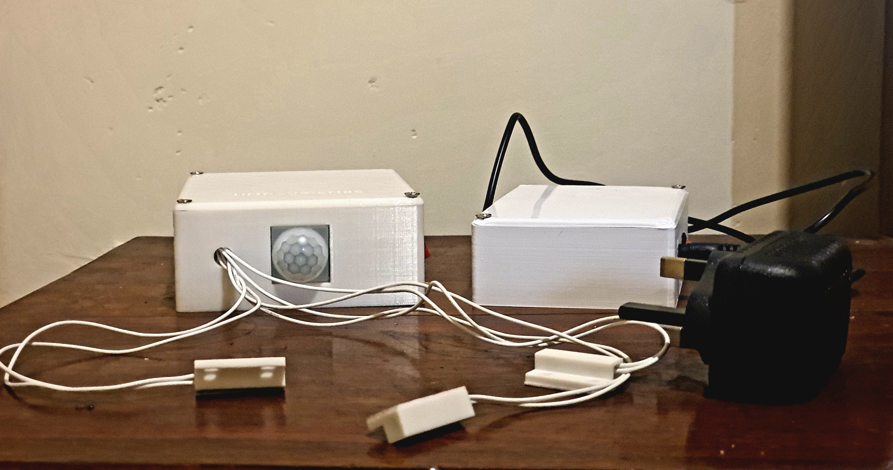
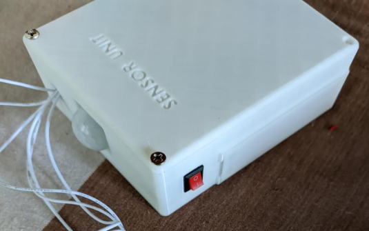
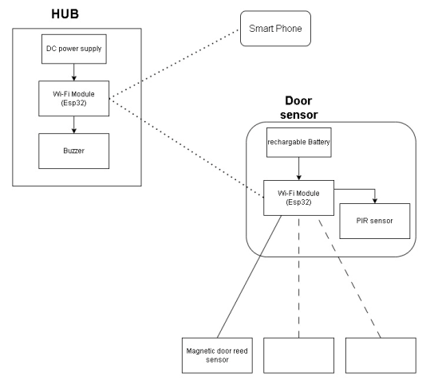
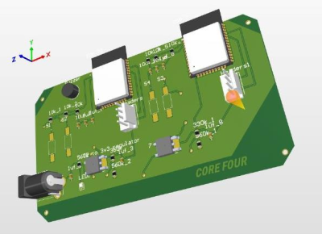
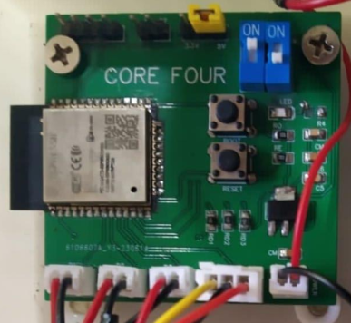

# IOT-based-home-security-system

This project is an IOT-based home security system that detects intruder entrances using a PIR motion sensor and three magnetic door reed switches. The system consists of two main components: the sensor unit and the WiFi gateway. The sensor unit is a compact device that can be placed in various locations to monitor for intruders. It reads data from the PIR motion sensor and three magnetic door reed switches, and sends the data to the WiFi gateway using ESP-NOW. The WiFi gateway connects to a WiFi network, sends the data to the Blynk cloud using the Blynk library, and displays the data on a Blynk app. It also allows users to control the door locks and alarm using the Blynk app.

  <table>
    <tr>
      <td align="center" style="padding: 10px;">
         
        <em style="font-size: 0.9em;">Sensor Unit with Hub</em>
      </td>
      <td align="center" style="padding: 10px;">
         
        <em style="font-size: 0.9em;">Sensor Unit</em>
      </td>
    </tr>
  </table>

## Architecture

The system architecture consists of two main components: the HUB and the Sensor Unit.

     
    <em style="font-size: 0.9em;">Overall Architecture of the design</em>

### HUB

The HUB is the device that connects to a smartphone and connects one or more sensor units that are attached to doors and windows. It is powered by a 230V power line. The HUB contains three components:

1. DC power supply: To step down 230V to 5V and power the other components in the HUB.
2. 2 Esp32 chips: One chip to communicate with each sensor unit and the other chip to receive the data that the first chip receives from sensor units and upload that data to the smartphone app.
3. Buzzer: To produce an audible alert to notify occupants or authorities of a potential security breach or unauthorized access.

### Sensor Unit

The Sensor Unit is the device that identifies unauthorized entry and communicates with the HUB. The Sensor Unit contains four components:

1. Rechargeable battery: 3.7V 3200mAh rechargeable battery that powers PIR sensor, magnetic door reed, and Wi-Fi module.
2. Magnetic door reed sensor: A magnetic door reed sensor is a device that detects the opening and closing of a door or window using a magnet and a reed switch.
3. PIR sensor: To detect movement inside the house.
4. Esp32 chip: To send the state of the window or door and the output of the PIR sensor to the HUB.

## Project Structure

The project structure consists of the following directories and files:

- `PCB`: Contains the design files for the PCBs used in the project.
- `Enclosure_design`: Contains the design files for the enclosure used in the project.
- `Src`: Contains the source code files for the project.
- `Final_project_Report.pdf`: The project report.
- `README.md`: README file for the project.

## Working Principle

The project consists of two main components: the sensor unit and the WiFi gateway. The sensor unit is responsible for detecting intruders and sending data to the WiFi gateway. It includes the following features:

- Reads data from the PIR motion sensor and three magnetic door reed switches.
- Sends the data to the WiFi gateway using ESP-NOW.
- Enters deep sleep mode when no intruders are detected.

The WiFi gateway receives data from the sensor unit and performs the following actions:

- Connects to a WiFi network.
- Sends the data to the Blynk cloud using the Blynk library.
- Displays the data on a Blynk app.
- Sends commands from the Blynk app to the sensor unit to control the door locks and alarm.

## ESP-NOW Protocol

The sensor unit and WiFi gateway communicate with each other using the ESP-NOW protocol. The ESP-NOW protocol is a lightweight wireless communication protocol that allows for fast and reliable data transfer between ESP8266/ESP32 devices. It is a one-way communication protocol, where the master device sends commands to the slave device. In this project, the WiFi gateway acts as the master device and the sensor unit acts as the slave device. The WiFi gateway sends commands to the sensor unit using ESP-NOW, and the sensor unit responds to the commands by sending data back to the WiFi gateway.

## Dependencies

The project uses the following dependencies:

- Arduino Core for ESP32
- Blynk library
- ESP-NOW library

## Hardware

### Components

- **Microcontroller**: ESP32-WROOM-32
- **Communication Protocol**: ESP NOW
- **Enclosure**: See the `Enclosure_Design/` directory for Solidworks CAD files.
- **Custom PCB**: See the `PCB/` directory for Altium files.

  <table>
    <tr>
      <td align="center" style="padding: 10px;">
         
        <em style="font-size: 0.9em;">Hub</em>
      </td>
      <td align="center" style="padding: 10px;">
         
        <em style="font-size: 0.9em;">Sensor Unit</em>
      </td>
    </tr>
  </table>

## Future Development

Future improvements for this project include:

- **Migrating to a robust IoT platform** to replace Blynk for better reliability and scalability.
- **Reducing the size of the sensor unit** for a more compact and unobtrusive design.
- **Enhancing the HUB** to support multiple sensor units simultaneously, enabling larger home or office coverage.
